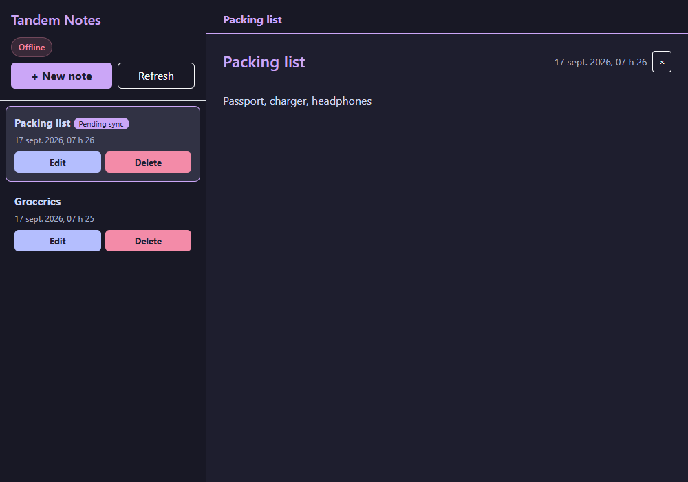
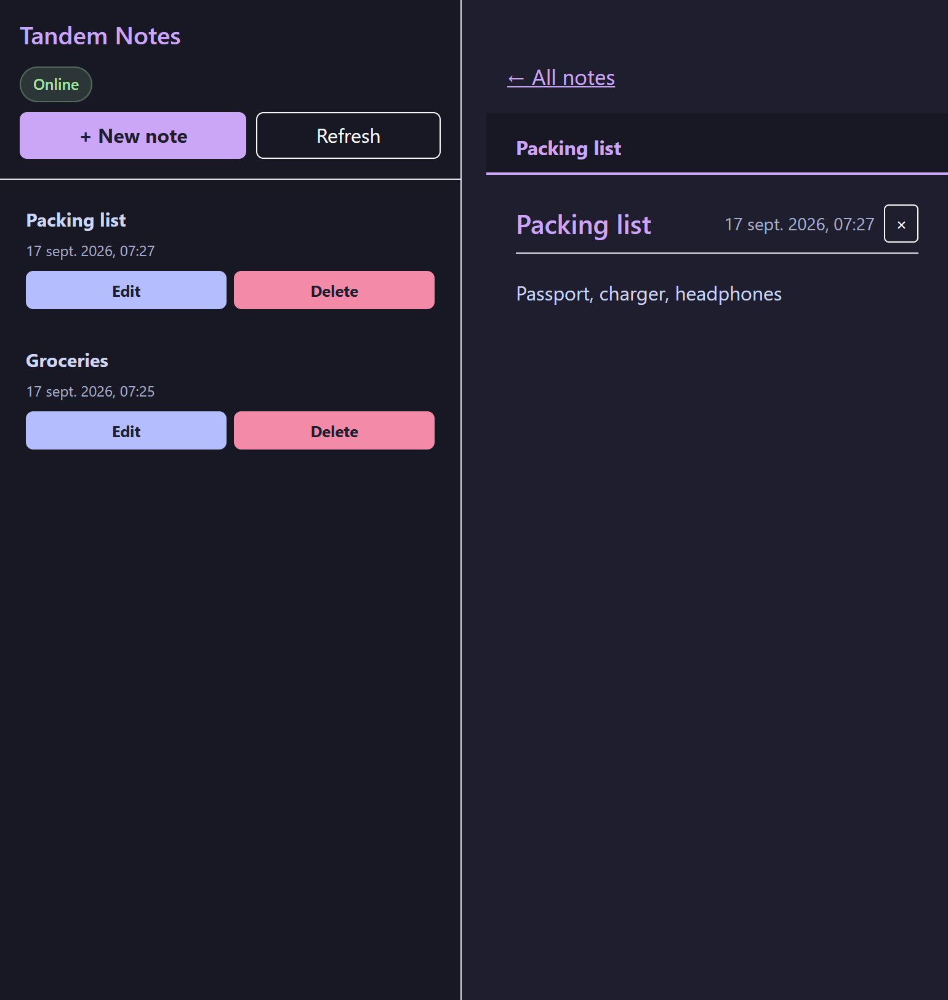

# tandem-notes

Notes that keep working when the server does not: a desktop and Android
app that reads and writes its notes locally first, and a small REST API
that holds the shared copy. Every change made while the server is out of
reach is queued on the device and replayed, in order, the next time it
answers.

Two projects in one repository: `notes-api`, an ASP.NET Core 8 Web API
with Entity Framework Core, and `notes-tauri`, a Tauri 2 application
whose interface is plain HTML, CSS and JavaScript.

## Screenshots






## How it works

**The device is the first source of truth.** `localService.js` keeps a copy
of the notes and a queue of pending changes in `localStorage`. The app
renders from the copy right away, then asks the API; when the API answers,
the copy is replaced, when it does not, the copy is what you see and the
status pill turns to Offline.

**Every write tries the server, then falls back.** `saveNote` and
`removeNote` in `main.js` call the API when the app believes it is online.
If the call cannot reach the server, the change is applied to the local
copy, queued, and the note gets a Pending sync badge. A note created
offline gets a temporary `local-` id; editing it again just refreshes its
queued entry, so the server receives the final text once.

**Replay in order, drop what the server refuses.** `syncPendingChanges`
runs on start, on the browser's `online` event and on Refresh. Changes are
sent in the order they were made. One the server could not be asked about
stays in the queue; one the server rejects with a status, a note deleted
elsewhere for instance, is dropped for good, because it would never
succeed. A queued create replaces the temporary note with the one the
server returns.

**The API validates and sets the dates.** `Note` requires a title of 1 to
100 characters and a body of at most 10 000; `[ApiController]` turns a
violation into a 400 before the service runs. `CreatedAt` and `UpdatedAt`
are set by `NoteService`, never taken from the client, and come back in
UTC with the `Z` whatever the database provider.

**Nothing is written into the page as HTML.** Titles and bodies go
through `textContent` and `createElement` only, so a note called
`` is shown as that text. The Tauri window carries
a Content Security Policy: scripts and styles from the app itself only,
connections to the local API and to HTTPS hosts only.

**One database provider or the other.** With an empty
`ConnectionStrings:DefaultConnection`, the API creates `notes.db` with
SQLite next to itself and a clone runs as is; with a connection string,
it uses SQL Server. Browsers are only accepted from the origins listed in
`AllowedOrigins`, which are the Tauri ones by default.

## Structure

```
notes-api/
  notes-api/
    Controllers/NotesController.cs   the five routes under /api/notes
    Services/NoteService.cs          the only class that touches the DbContext
    Interfaces/INoteService.cs
    Models/Note.cs                   validation attributes
    Data/AppDbContext.cs             UTC conversion for the dates
    Program.cs                       provider choice, CORS, HTTPS, Swagger
    appsettings.json                 connection string and allowed origins
    notes-api.http                   ready-to-send requests
  notes-api.Tests/
    ApiFactory.cs                    the app on an in-memory SQLite database
    NotesEndpointsTests.cs           11 tests through HTTP
notes-tauri/
  src/
    index.html
    main.js                          views, saving, deleting, sync
    config.js                        API_URL
    services/noteService.js          fetch calls
    services/localService.js         local copy and pending queue
    styles.css
    vendor/bootstrap/                Bootstrap 5.3.3, bundled for offline use
  src-tauri/                         Tauri 2 shell, desktop and Android
```

## Running it

The API, from `notes-api/notes-api`:

```bash
dotnet run --launch-profile http
```

It listens on `http://localhost:5011`, creates `notes.db` on first start
and serves Swagger at `/swagger` in Development. The tests, from
`notes-api`:

```bash
dotnet test
```

The desktop app, from `notes-tauri` (Rust and the Tauri prerequisites
installed):

```bash
npm install
npm run tauri dev
```

`config.js` points at the local API. For a build that talks to a hosted
instance, change `API_URL` there, and, on Android, use the machine's
address on the network rather than `localhost`. `npm run tauri android
dev` runs it on a connected device or emulator.

## Stack

ASP.NET Core 8 Web API, Entity Framework Core 8 with SQLite and SQL
Server providers, xUnit with `WebApplicationFactory` for the tests. Tauri
2 for the desktop and Android shells, HTML, CSS and JavaScript modules
for the interface, Bootstrap 5.3 bundled locally.

## Résumé

Des notes qui continuent de fonctionner quand le serveur ne répond pas :
une application de bureau et Android qui lit et écrit d'abord sur
l'appareil, et une petite API REST qui garde la copie partagée. Chaque
modification faite hors ligne est mise en file sur l'appareil, avec un
badge « Pending sync », puis rejouée dans l'ordre dès que le serveur
répond de nouveau ; ce que le serveur refuse est abandonné, ce qu'il n'a
pas pu recevoir attend. L'API valide le titre et le corps, fixe elle-même
les dates en UTC, n'accepte que les origines Tauri et tourne sur SQLite
sans configuration ou sur SQL Server avec une chaîne de connexion. Onze
tests xUnit passent par HTTP sur une base SQLite en mémoire.

## Licence

MIT. See [LICENSE](LICENSE).
